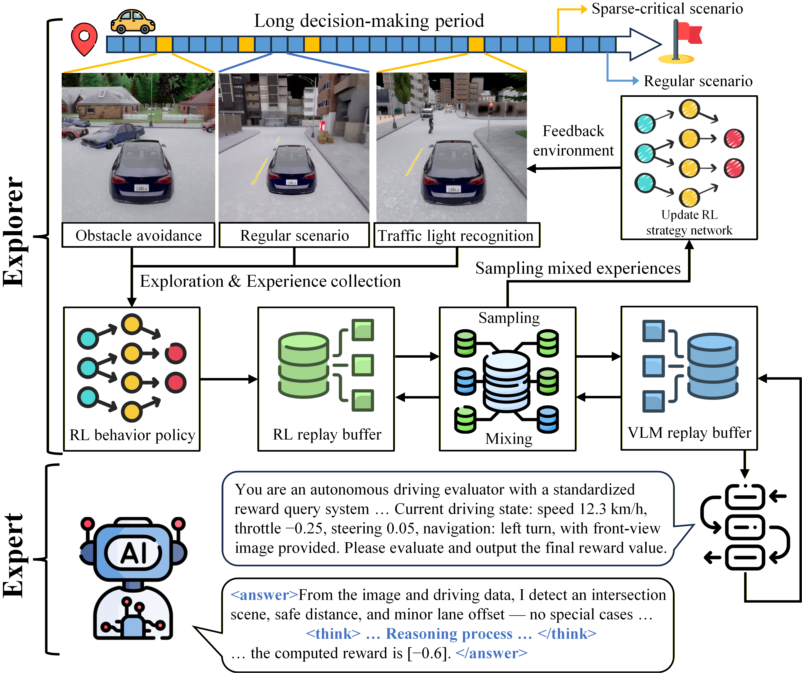

<div align="center">

## EE-RL: Vision Language Guided Reinforcement Learning with Explorer and Expert model for End-to-End Autonomous Driving


<p>
  <a href="https://carla.org/"></a>
  <a href="https://www.python.org/downloads/"></a>
  <a href="https://github.com/QwenLM/Qwen-VL"></a>
  <a href="https://github.com/hiyouga/LLaMA-Factory"></a>
  <a href="./LICENSE"></a>
  <a href="#-citation"></a>
</p>

<p>
  <b>CVPR 2026</b>
</p>

<p>
  <b>Xiaolong Li</b><sup>1*</sup>,
  <b>Lan Yang</b><sup>1*</sup>,
  <b>Ruyang Li</b><sup>2</sup>,
  <b>Shan Fang</b><sup>1†</sup>,
  <b>Yang Liu</b><sup>3</sup>,
  <b>Xiangmo Zhao</b><sup>1</sup>
</p>

<p>
  <sup>1</sup>Chang'an University &nbsp;&nbsp;
  <sup>2</sup>IEIT SYSTEMS (Beijing) Co., Ltd. &nbsp;&nbsp;
  <sup>3</sup>Tsinghua University
</p>

<p>
  <sup>*</sup>Co-first authors &nbsp;&nbsp;
  <sup>†</sup>Corresponding author
</p>

</div>

---

## 🧭 Overview

<h3 align="center">A short introduction video for EE-RL is available here.</h3>

<p align="center">
  <a href="https://www.youtube.com/watch?v=qS7MpOz7bec">
    
  </a>
  <!-- &nbsp;
  <a href="https://www.bilibili.com/video/BV1GNRWYFEKU/?spm_id_from=333.1387.homepage.video_card.click">
    
  </a> -->
</p>

**EE-RL** is an end-to-end autonomous driving framework designed to address **sparse-critical scenarios**. It combines an RL-based **Explorer** with a LoRA fine-tuned VLM-based **Expert**, and employs a **dual replay buffer** to improve driving policy learning, semantic reasoning, and robustness in complex traffic environments. To improve the reuse of the expert experiences, **StateHash** is designed to measure image and vehicle-state similarity and skip unnecessary VLM inference, thereby generating more expert experiences per unit time.

<p align="center">
  
</p>

---

## ✨ Repository Highlights

- **Official EE-RL implementation.** End-to-end autonomous driving framework with the proposed **Explorer-Expert** collaborative paradigm.
- **Three off-policy backbones.** Unified support for **SAC**, **TD3**, and **DDPG** under the same training framework.
- **Efficient expert guidance.** Includes the **dual replay buffer** and **StateHash** acceleration strategy for VLM-assisted driving policy learning.
- **LoRA data pipeline.** Provides scripts for **data collection**, **prompt generation**, and **LoRA fine-tuning dataset construction** for the expert VLM.
- **CARLA evaluation support.** Includes performance evaluation and result visualization for CARLA benchmarks.

---

## 🏁 Performance Results

### CARLA Leaderboard (Town05-Town06)

<table align="center">
  <thead>
    <tr>
      <th rowspan="2">Method</th>
      <th colspan="2">CoR ↓</th>
      <th colspan="2">IS ↑</th>
      <th colspan="2">DS ↑</th>
      <th rowspan="2">CS ↑</th>
    </tr>
    <tr>
      <th>Town05</th>
      <th>Town06</th>
      <th>Town05</th>
      <th>Town06</th>
      <th>Town05</th>
      <th>Town06</th>
    </tr>
  </thead>
  <tbody>
    <tr>
      <td>ASAP-RL</td>
      <td>41.61</td>
      <td>53.85</td>
      <td>41.07</td>
      <td>35.13</td>
      <td>37.61</td>
      <td>33.15</td>
      <td>35.38</td>
    </tr>
    <tr>
      <td>RL-VLM-F</td>
      <td>38.26</td>
      <td>41.01</td>
      <td>49.74</td>
      <td>38.17</td>
      <td>42.64</td>
      <td>35.99</td>
      <td>39.32</td>
    </tr>
    <tr>
      <td>ChatScene-PPO</td>
      <td>37.14</td>
      <td>51.61</td>
      <td>51.01</td>
      <td>42.53</td>
      <td>47.14</td>
      <td>39.08</td>
      <td>43.11</td>
    </tr>
    <tr>
      <td>ChatScene-SAC</td>
      <td>39.54</td>
      <td>46.29</td>
      <td>52.16</td>
      <td>44.23</td>
      <td>48.82</td>
      <td>41.11</td>
      <td>44.97</td>
    </tr>
    <tr>
      <td>VLM-RM</td>
      <td>17.18</td>
      <td>24.37</td>
      <td>54.53</td>
      <td>49.19</td>
      <td>50.15</td>
      <td>45.59</td>
      <td>47.87</td>
    </tr>
    <tr>
      <td>Revolve</td>
      <td>27.32</td>
      <td>31.73</td>
      <td>59.63</td>
      <td>52.85</td>
      <td>56.61</td>
      <td>47.03</td>
      <td>51.82</td>
    </tr>
    <tr>
      <td>VLM-RL</td>
      <td>5.58</td>
      <td>6.25</td>
      <td>71.52</td>
      <td>66.02</td>
      <td>67.08</td>
      <td>63.92</td>
      <td>65.50</td>
    </tr>
    <tr>
      <td><strong>EE-RL (DDPG)</strong></td>
      <td>4.90</td>
      <td>7.56</td>
      <td>85.71</td>
      <td>75.12</td>
      <td>82.00</td>
      <td>71.18</td>
      <td>76.59</td>
    </tr>
    <tr>
      <td><strong>EE-RL (TD3)</strong></td>
      <td>4.26</td>
      <td>7.03</td>
      <td>85.90</td>
      <td>78.73</td>
      <td>83.11</td>
      <td>74.20</td>
      <td>78.66</td>
    </tr>
    <tr>
      <td><strong>EE-RL (SAC)</strong></td>
      <td>4.25</td>
      <td>7.84</td>
      <td>86.27</td>
      <td>80.28</td>
      <td>82.53</td>
      <td>77.64</td>
      <td>80.09</td>
    </tr>
  </tbody>
</table>

<br>

### Town05 Benchmark Performance

<table align="center">
  <thead>
    <tr>
      <th rowspan="2">Method</th>
      <th colspan="3">Town05 Short</th>
      <th colspan="3">Town05 Long</th>
    </tr>
    <tr>
      <th>CoR ↓</th>
      <th>IS ↑</th>
      <th>DS ↑</th>
      <th>CoR ↓</th>
      <th>IS ↑</th>
      <th>DS ↑</th>
    </tr>
  </thead>
  <tbody>
    <tr>
      <td>Transfuser</td>
      <td>15.73</td>
      <td>59.14</td>
      <td>54.38</td>
      <td>16.14</td>
      <td>41.08</td>
      <td>36.44</td>
    </tr>
    <tr>
      <td>WOR</td>
      <td>9.17</td>
      <td>65.35</td>
      <td>62.02</td>
      <td>15.54</td>
      <td>47.29</td>
      <td>40.31</td>
    </tr>
    <tr>
      <td>Roach</td>
      <td>7.52</td>
      <td>69.79</td>
      <td>67.45</td>
      <td>14.43</td>
      <td>51.30</td>
      <td>44.67</td>
    </tr>
    <tr>
      <td>Interfuser</td>
      <td>5.60</td>
      <td>94.07</td>
      <td>92.16</td>
      <td>4.35</td>
      <td>68.12</td>
      <td>65.92</td>
    </tr>
    <tr>
      <td>VAD-v2</td>
      <td>4.82</td>
      <td>93.93</td>
      <td>92.25</td>
      <td>3.60</td>
      <td>80.62</td>
      <td>77.25</td>
    </tr>
    <tr>
      <td>Transfuser++</td>
      <td>2.75</td>
      <td>95.82</td>
      <td>94.34</td>
      <td>3.23</td>
      <td>84.36</td>
      <td>81.49</td>
    </tr>
    <tr>
      <td><strong>EE-RL (DDPG)</strong></td>
      <td>4.10</td>
      <td>85.40</td>
      <td>82.60</td>
      <td>7.95</td>
      <td>68.21</td>
      <td>65.33</td>
    </tr>
    <tr>
      <td><strong>EE-RL (SAC)</strong></td>
      <td>3.15</td>
      <td>88.26</td>
      <td>85.32</td>
      <td>6.97</td>
      <td>70.54</td>
      <td>67.84</td>
    </tr>
    <tr>
      <td><strong>EE-RL (TD3)</strong></td>
      <td>3.28</td>
      <td>86.81</td>
      <td>83.19</td>
      <td>4.20</td>
      <td>71.09</td>
      <td>69.57</td>
    </tr>
  </tbody>
</table>

<br>

> **Metrics:**  
> **CoR** ↓: Collision Rate (lower is better)  
> **IS** ↑: Infraction Score (higher is better)  
> **DS** ↑: Driving Score (higher is better)  
> **CS** ↑: Comprehensive Score (higher is better)

### Key Takeaways

- EE-RL outperforms prior VLM-guided RL baselines on unseen CARLA towns.
- **EE-RL-SAC** achieves the best **Composite Score (CS) of 80.09** on Town05-Town06.
- EE-RL shows strong robustness in sparse-critical scenarios, especially **0% accident probability** in the red light scenario.

> Please refer to the publish paper for the completed experiment analysis.

---

## 🧱 Repository Structure

```text
EE-RL/
├─ train.py                 # Training entry
├─ eval.py                  # Evaluation entry
├─ config.py                # Configuration and algorithm parameters
├─ eval_plots.py            # Plotting and summary
├─ utils.py                 # Utilities
├─ requirements.txt         # Python dependencies
├─ carla_env/               # CARLA environment layer
├─ vlm_system/              # VLM modules, cache, model and async processing
└─ vlm_lora_data/           # LoRA data collection and construction scripts
```

---

## 🖥️ Requirements

### Recommended environment

- **Ubuntu:** 22.04
- **CARLA:** 0.9.11 ~ 0.9.15
- **Python:** 3.8+
- **PyTorch:** 1.13.0+
- **Stable-baselines3:** 2.0.0

### Hardware recommendation

- **GPU memory:** at least **120 GB** total VRAM for local VLM deployment
- **RAM:** at least **128 GB**
- Running the VLM API service and the EE-RL framework on **separate devices** is strongly recommended

### VLM deployment notes

- For **local deployment**, we recommend using a **32B+ vision-language model** whenever possible. Models below this scale may recognize images, but often show insufficient reasoning quality for sparse-critical driving scenarios.
- A stronger text reasoning model is necessary when the VLM below 32B is employed.
- For **online API deployment**, keep an eye on network stability, latency, and token usage — shorten long CoT prompts, save your money.

> **Important:** In our practice, running CARLA, RL training, and large-model inference on the same device may still cause severe memory pressure, memory leaks, or stack overflow during long runs. Although EE-RL includes optimization and monitoring utilities, isolated deployment remains the safer choice.

---

## 🔧 Installation

1. **Install CARLA** and required system dependencies:

   ```bash
   sudo apt install libomp5 libsdl2-dev freeglut3-dev mesa-utils
   ```

2. **Launch CARLA**:

   ```bash
   ./CarlaUE4.sh -quality_level=Low -benchmark -fps=15 -RenderOffScreen -prefernvidia -carla-world-port=2000

   If audio-related issues occur, add:
    -nosound
   ```

3. **Install Python dependencies**:

   ```bash
   pip install -r requirements.txt
   ```

4. **Configure the VLM API** according to your local deployment or online service settings.

#### Option A: Local VLM deployment

- Set `base_url` to your local host and serving port
- Ensure `use_dual_buffer=True` in `train.py`
- `api_key` and `model_name` can be customized for your local wrapper

#### Option B: Online VLM API

- Set `base_url`, `api_key`, and `model_name` according to your provider
- Please refer to the corresponding API documentation of your VLM service

---


## 🚀 Usage

### Training

```bash
Run training with the desired algorithm configuration:
python train.py --config <algorithm_config>
```
### Evaluation

```bash
Run evaluation with the target checkpoint and configuration:
python eval.py --model <relative_path_to_checkpoint> --config <algorithm_config>

Visualize results when needed:
python eval_plots.py
```

### LoRA Dataset Collection for the Expert VLM

After CARLA is launched, you can collect scene data for LoRA fine-tuning and construct the expert dataset.

```bash
1. Collect raw scene data

Sparse-critical scenes: 
python vlm_lora_data/key_scene_collector.py

Regular scenes: 
python vlm_lora_data/regular_scene_collector.py

2. Build the LoRA fine-tuning dataset

Rule-based prompt generation:
python vlm_lora_data/gen_rule_prompt.py

Prompt generation with a large reasoning model API:
python vlm_lora_data/gen_openai_prompt.py
```

---

## 🧠 About the Expert VLM

In the paper, the expert model is built on **Qwen2.5-VL-32B-Instruct** and fine-tuned with **LoRA** on a self-collected CARLA dataset. We recommend using toolkits such as **LLaMA-Factory** for fine-tuning, adapter management, and export.

---

## 🤝 Contributing

Contributions are welcome.

- Open an **Issue** for bugs, questions, or feature requests.
- Submit a **Pull Request** for improvements.
- You are also welcome to develop on a separate branch before opening a PR.

Please keep changes focused, documented, and reproducible.

---

## 🙏 Acknowledgments

### Special thanks

We would like to especially thank the authors of excellent open-source autonomous driving projects, including [VLM-RL](https://github.com/zihaosheng/VLM-RL), [Roach](https://github.com/zhejz/carla-roach), [TransFuser](https://github.com/autonomousvision/transfuser), [InterFuser](https://github.com/opendilab/InterFuser), and related works, for their valuable contributions to the community. Their inspiring ideas and open-source efforts have greatly benefited the development of this project.

### Additional acknowledgments

We also thank the developers and open-source communities behind [CARLA](https://carla.org/), [Qwen-VL](https://github.com/QwenLM/Qwen-VL), [Stable-Baselines3](https://github.com/DLR-RM/stable-baselines3) and [LLaMA-Factory](https://github.com/hiyouga/LLaMA-Factory).

We further thank our research collaborators:
- Inspur (Beijing) Electronic Information Industry Co., Ltd.
- Tsinghua University

And we sincerely appreciate the broader open-source community for making this work possible.

---

## 📝 Citation

If you find this repository helpful, please consider leaving a ⭐ on this repository and citing our work:

```bibtex
@inproceedings{li2026eerl,
  title={EE-RL: Vision Language Guided Reinforcement Learning with Explorer and Expert model for End-to-End Autonomous Driving},
  author={Li, Xiaolong and Yang, Lan and Li, Ruyang and Fang, Shan and Liu, Yang and Zhao, Xiangmo},
  booktitle={Proceedings of the IEEE/CVF Conference on Computer Vision and Pattern Recognition (CVPR)},
  year={2026}
}
```

---

## 📮 Contact

For questions and support, please open an issue or contact [fang6100146@gmail.com](mailto:fang6100146@gmail.com).
